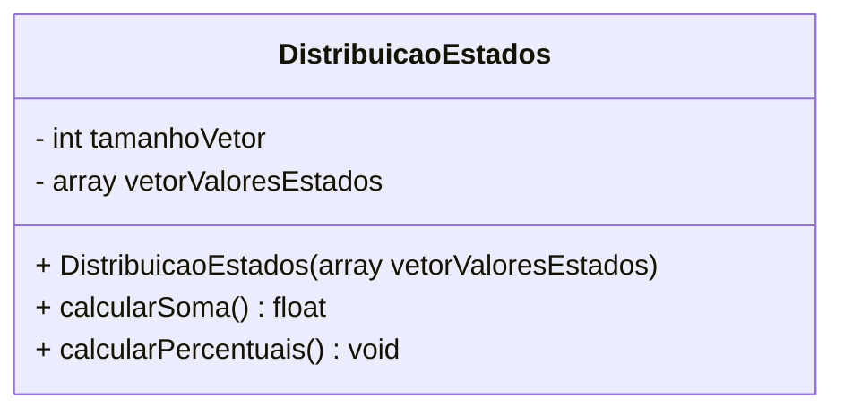

```mermaid
classDiagram
    class DistribuicaoEstados {
        - int tamanhoVetor
        - array vetorValoresEstados
        + DistribuicaoEstados(array vetorValoresEstados)
        + calcularSoma() float
        + calcularPercentuais() void
    }
```
