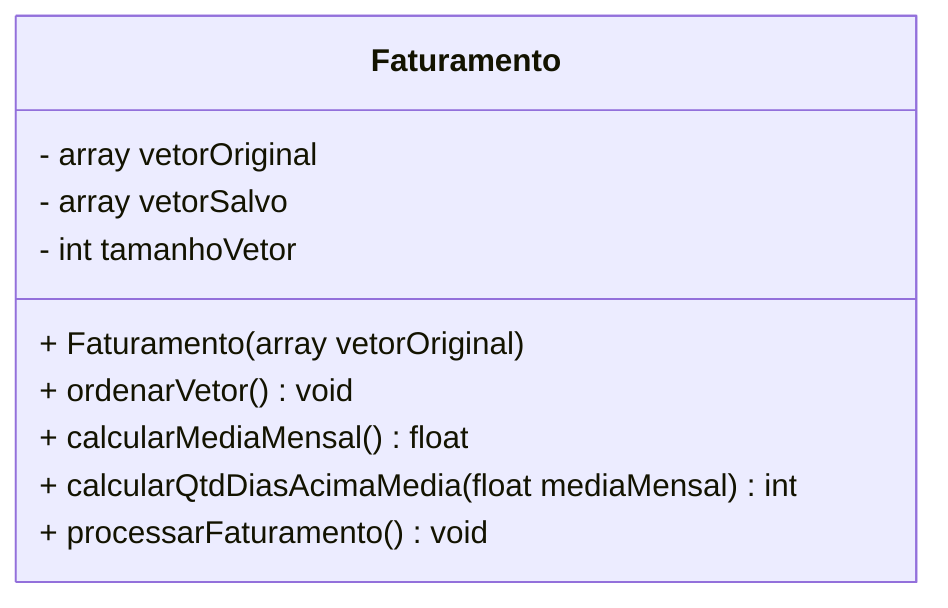

```mermaid
classDiagram
    class Faturamento {
        - array vetorOriginal
        - array vetorSalvo
        - int tamanhoVetor
        + Faturamento(array vetorOriginal)
        + ordenarVetor() void
        + calcularMediaMensal() float
        + calcularQtdDiasAcimaMedia(float mediaMensal) int
        + processarFaturamento() void
    }
```
