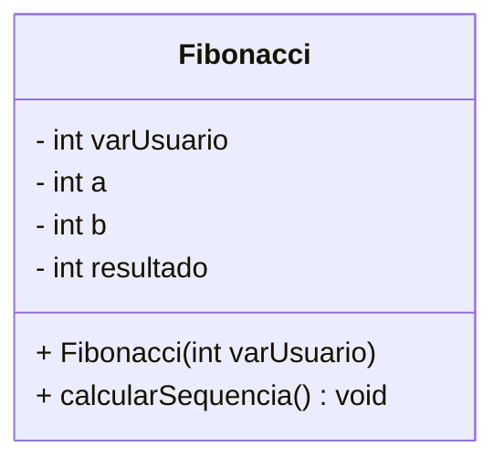

```mermaid
classDiagram
    class Fibonacci {
        - int varUsuario
        - int a
        - int b
        - int resultado
        + Fibonacci(int varUsuario)
        + calcularSequencia() void
    }
```
